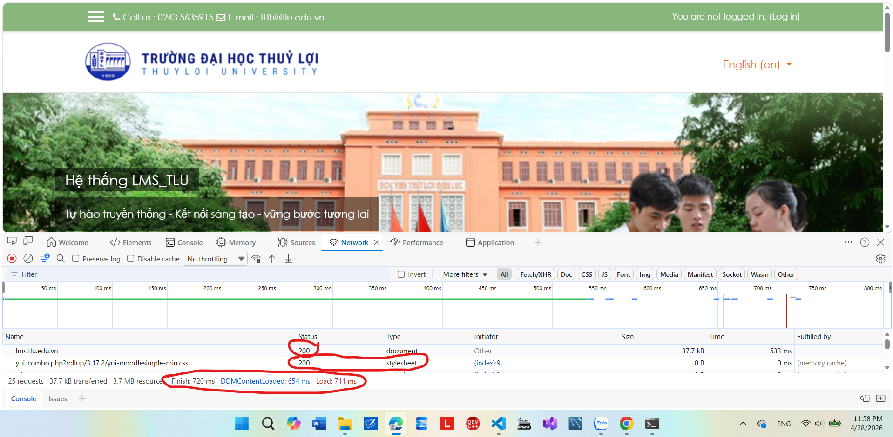

# Phần A
## Câu A1: 
### Câu 1: Khi bạn gõ https://shopee.vn vào trình duyệt và nhấn Enter, hãy liệt kê đúng thứ tự ít nhất 5 bước xảy ra (từ DNS lookup đến render).'
# Dựa trên hành trình "0.3 giây xuyên đại dương" và mô hình Client-Server, các bước diễn ra như sau:
1. Bước 1: DNS Lookup: Trình duyệt hỏi DNS server để chuyển đổi "shopee.vn" thành địa chỉ IP của server.
2. Bước 2: Thiết lập kết nối (TCP + TLS) : Trình duyệt tạo kết nối với server
3. Bước 3: Gửi HTTP Request: Trình duyệt gửi request kiểu GET / đến server Shopee
4. Bước 4: Server xử lí: Server nhận request sau đó xử lí logic và chuẩn bị dữ liệu
5. Bước 5: Server trả về HTTP Response: Trả về HTML chính 
6. Bước 6: Trình duyệt chuyển đổi HTML sau đó render ra giao diện
7. Bước 7: Người dùng thấy giao diện shopee
### Câu 2: Trong DevTools của Chrome, tab Network cho thấy thông tin gì?
# Dựa vào file 01_introduction_html_universe.md phần 4.3
Tab NetWork: xem request/ reponses  
Ví dụ: Thời gian load từng file, Dung lượng file, loại tài nguyên   
Công dụng: Website tải chậm - file nào nặng nhất có thể dùng để biết web chậm vì cái gì  
  

## Câu A2:
```html
<div class="header">
    <div class="logo">ShopTLU</div>
    <div class="menu">
        <div><a href="/">Trang chủ</a></div>
        <div><a href="/products">Sản phẩm</a></div>
    </div>
</div>
<div class="main">
    <div class="product">
        <div class="title">iPhone 16 Pro</div>
        <div class="price">25.990.000đ</div>
        <div class="image"></div>
    </div>
</div>
<div class="footer">© 2026 ShopTLU</div>
```
Đoạn HTML này nhìn vẫn chạy được, nhưng với Google thì nó “khó hiểu” vì thiếu semantic (ý nghĩa cấu trúc)  
Lỗi semantic:  
Lỗi 1: dùng div thay vì header(sửa `<div class="header">` thành `<header>`)  
Lỗi 2: dùng div thay vì dùng nav(sửa `<div class = menu>` thành `<nav>`)  
Lỗi 3: dùng div thay vì dùng main sẽ (sửa `<div class = main>` thành `<main>`)  
Lỗi 4: dùng div thay vì dùng footer sẽ (sửa `<div class = footer>` thành `<footer>`)  
## Câu A3:

```html
<div>Hộp 1</div>
<span>Text A</span>
<span>Text B</span>
<div>Hộp 2</div>
<span>Text C</span>
<strong>Text D</strong>
<div>Hộp 3</div>
```

Hộp 1  
Text A Text B  
Hộp 2  
Text C Text D  
Hộp 3  
Giải thích: bởi vì thẻ ```<div>``` là thẻ block nên luôn chiếm hết dòng thẻ ```<span>``` và thẻ ```<strong> là thẻ inline nên sẽ nằm cùng một dòng

## Câu A4:

```<thead>```:  phần tiêu đề của bảng
```<tbody>```:  Dữ liệu chính của bảng
```<tfoot>```:  Chứa phần cuối của bảng(Thường dùng để tổng kết ví dụ như tính tổng hóa đơn)  
Không nên dùng table cho layout vì
1. Không senmatic -> SEO kém
2. Khó reponsive trên mobile
3. Code phức tạp, khó bảo trì
4. Hiệu năng kém hơn

# Phần C

## Câu C1 — Thiết kế cấu trúc
Bạn được giao thiết kế cấu trúc HTML cho trang chi tiết sản phẩm (giống trang sản phẩm Shopee/Tiki). Trang bao gồm:  
Header + Navigation  
Breadcrumb (Trang chủ > Điện thoại > iPhone 16)  
Khu vực ảnh sản phẩm (5 ảnh)  
Thông tin sản phẩm (tên, giá, đánh giá sao, mô tả)  
Bảng thông số kỹ thuật  
Khu vực đánh giá/bình luận  
Sidebar: Sản phẩm tương tự  
Footer  
Yêu cầu: Viết chỉ phần cấu trúc HTML (không cần nội dung thật, chỉ cần đúng thẻ và nesting). Mỗi thẻ phải có comment giải thích tại sao bạn chọn thẻ đó.  

```html
<!DOCTYPE html>
<html lang="vi">
<head>
    <meta charset="UTF-8"> <!-- hỗ trợ tiếng Việt -->
    <meta name="viewport" content="width=device-width, initial-scale=1.0"> <!-- responsive -->
    <title>Chi tiết sản phẩm</title>
</head>

<body>

    <!-- HEADER -->
    <header> <!-- header: phần đầu trang -->
        <div class="logo">ShopTLU</div> <!-- logo -->
        
        <nav> <!-- nav: khu vực điều hướng chính -->
            <ul> <!-- ul: danh sách menu -->
                <li><a href="/">Trang chủ</a></li>
                <li><a href="/products">Sản phẩm</a></li>
            </ul>
        </nav>
    </header>

    <!-- BREADCRUMB -->
    <nav aria-label="breadcrumb"> <!-- nav: điều hướng -->
        <ol> <!-- ol: có thứ tự -->
            <li><a href="/">Trang chủ</a></li>
            <li><a href="/phones">Điện thoại</a></li>
            <li>iPhone 16</li> <!-- item hiện tại -->
        </ol>
    </nav>

    <!-- MAIN CONTENT -->
    <main> <!-- main: nội dung chính của trang -->

        <!-- KHU VỰC SẢN PHẨM -->
        <section class="product-detail"> <!-- section: nhóm nội dung sản phẩm -->

            <!-- ẢNH SẢN PHẨM -->
            <section class="product-images"> <!-- section: nhóm ảnh -->
                <h2>Hình ảnh sản phẩm</h2> <!-- heading cho SEO -->
                
                <figure> <!-- figure: chứa ảnh -->
                     <!-- alt: SEO + accessibility -->
                </figure>

                <figure>
                    
                </figure>

                <figure>
                    
                </figure>

                <figure>
                    
                </figure>

                <figure>
                    
                </figure>
            </section>

            <!-- THÔNG TIN SẢN PHẨM -->
            <article class="product-info"> <!-- article: nội dung độc lập (1 sản phẩm) -->
                
                <h1>iPhone 16 Pro</h1> <!-- h1: tiêu đề chính -->

                <p class="price">25.990.000đ</p> <!-- p: văn bản -->

                <div class="rating"> <!-- div: nhóm đánh giá -->
                    ★★★★☆ (100 đánh giá)
                </div>

                <section class="description"> <!-- section: mô tả -->
                    <h2>Mô tả sản phẩm</h2>
                    <p>...</p>
                </section>

            </article>

        </section>

        <!-- BẢNG THÔNG SỐ -->
        <section class="specs"> <!-- section: nhóm thông số -->
            <h2>Thông số kỹ thuật</h2>

            <table> <!-- table: dữ liệu dạng bảng -->
                <thead> <!-- thead: tiêu đề bảng -->
                    <tr>
                        <th>Thông số</th>
                        <th>Chi tiết</th>
                    </tr>
                </thead>

                <tbody> <!-- tbody: dữ liệu chính -->
                    <tr>
                        <td>Màn hình</td>
                        <td>...</td>
                    </tr>
                </tbody>

                <tfoot> <!-- tfoot: tổng kết -->
                    <tr>
                        <td colspan="2">Thông tin chỉ mang tính tham khảo</td>
                    </tr>
                </tfoot>
            </table>
        </section>

        <!-- ĐÁNH GIÁ / BÌNH LUẬN -->
        <section class="reviews"> <!-- section: nhóm đánh giá -->
            <h2>Đánh giá khách hàng</h2>

            <article class="review"> <!-- article: mỗi review độc lập -->
                <p>Người dùng A: Sản phẩm rất tốt</p>
            </article>

            <article class="review">
                <p>Người dùng B: Đáng mua</p>
            </article>
        </section>

    </main>

    <!-- SIDEBAR -->
    <aside> <!-- aside: nội dung phụ (sản phẩm liên quan) -->
        <h2>Sản phẩm tương tự</h2>

        <article class="related-product"> <!-- mỗi sản phẩm -->
            <p>iPhone 15</p>
        </article>

        <article class="related-product">
            <p>Samsung S24</p>
        </article>
    </aside>

    <!-- FOOTER -->
    <footer> <!-- footer: chân trang -->
        <p>© 2026 ShopTLU</p>
    </footer>

</body>
</html>
```


## Câu C2: Một đồng nghiệp nói: "Dùng ```<div>``` cho mọi thứ rồi thêm class là được, không cần semantic HTML. Tốn thời gian học thêm thẻ mới." Viết 1 đoạn phản biện (200-300 từ), phải bao gồm: Ít nhất 2 lý do kỹ thuật (SEO, Accessibility) 1 ví dụ cụ thể chứng minh semantic HTML giúp ích 1 trường hợp thực tế mà ```<div>``` vẫn phù hợp

Ý kiến “dùng div cho mọi thứ rồi thêm class là được” nghe có vẻ nhanh nhưng về lâu dài là không hợp lý. Thứ nhất là về SEO. Công cụ tìm kiếm như Google không nhìn giao diện mà đọc cấu trúc HTML. Khi sử dụng các thẻ semantic như header, main, article, h1, Google có thể hiểu đâu là nội dung chính, đâu là tiêu đề quan trọng. Nếu chỉ dùng div, trang web sẽ thiếu ý nghĩa về mặt cấu trúc và dễ bị đánh giá thấp hơn.

Thứ hai là về khả năng truy cập. Các công cụ hỗ trợ như screen reader cho người khiếm thị dựa vào semantic HTML để đọc trang. Ví dụ, thẻ nav giúp người dùng di chuyển nhanh giữa các menu, thẻ main giúp bỏ qua phần header để vào nội dung chính. Nếu toàn bộ chỉ là div thì trải nghiệm sử dụng sẽ kém hơn rất nhiều.

Một ví dụ cụ thể là trang chi tiết sản phẩm. Nếu tiêu đề dùng h1 và nội dung nằm trong article, Google sẽ hiểu đây là phần quan trọng của trang và ưu tiên hiển thị khi tìm kiếm. Đồng thời người dùng sử dụng screen reader cũng dễ dàng nắm được cấu trúc nội dung.

Tuy nhiên, div vẫn có vai trò riêng. Nó phù hợp khi cần nhóm các phần tử để phục vụ cho việc layout hoặc styling bằng CSS, đặc biệt khi không có thẻ semantic nào mô tả chính xác mục đích đó.

Tóm lại, semantic HTML không phải là tốn thời gian mà là cách viết code rõ ràng, dễ hiểu và thân thiện hơn với cả công cụ tìm kiếm lẫn người dùng.


