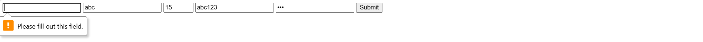
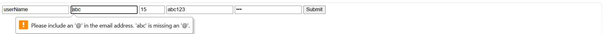
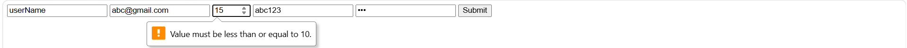
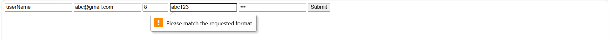
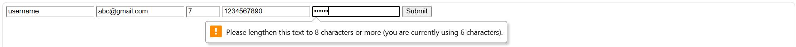

# Phần A: Kiểm tra đọc hiểu
### Câu A1:
1. type="email" → Ô nhập text dạng email, tự kiểm tra có ký tự @ và định dạng email hợp lệ → Dùng cho đăng ký tài khoản, nhập email nhận đơn hàng

2. type="password" → Ô nhập mật khẩu, ký tự bị ẩn (••••) → Dùng cho đăng nhập, tạo tài khoản

3. type="text" → Ô nhập văn bản bình thường, không validation đặc biệt → Dùng cho tên khách hàng, địa chỉ nhận hàng

4. type="number" → Ô nhập số, có thể giới hạn min/max → Dùng cho số lượng sản phẩm trong giỏ hàng

5. type="tel" → Ô nhập số điện thoại, không bắt buộc format nhưng hỗ trợ mobile keypad → Dùng cho nhập số liên hệ giao hàng

6. type="date" → Ô chọn ngày dạng calendar → Dùng cho chọn ngày giao hàng hoặc đặt lịch giao

7. type="checkbox" → Ô chọn dạng tick (có/không), không validation bắt buộc → Dùng cho chọn đồng ý điều khoản hoặc chọn nhiều sản phẩm phụ

8. type="radio" → Ô chọn một trong nhiều lựa chọn → Dùng cho chọn phương thức thanh toán (COD, thẻ, ví điện tử)

9. type="file" → Cho phép upload file từ máy tính → Dùng cho upload ảnh sản phẩm hoặc ảnh xác nhận thanh toán

10. type="search" → Ô nhập tìm kiếm, có thể có nút xóa nhanh → Dùng cho thanh tìm kiếm sản phẩm trên trang E-Commerce

### Câu A2:
```
<!-- Trường hợp 1 -->
<input type="text" required value="">   <!-- User để trống -->
```
Trường hợp này sẽ không submit được vì required bắt buộc phải nhập ô dữ liệu. Ô trống nên trình duyệt chặn submit và báo “Please fill out this field”.  


```
<!-- Trường hợp 2 -->
<input type="email" value="abc">        <!-- User gõ "abc" -->
```
Trường hợp này không submit được vì type là email nên phải có định dạng của email

```
<!-- Trường hợp 3 -->
<input type="number" min="1" max="10" value="15"> <!-- User gõ 15 -->
```
Không submit được vì giá trị nhập vào là 15 lớn hơn max=10

```
<!-- Trường hợp 4 -->
<input type="text" pattern="[0-9]{10}" value="abc123"> <!-- User gõ "abc123" -->
```
Không submit được vì pattern yêu cầu nhập đủ 10 kí tự và kí tự là số từ 0->9  

```
<!-- Trường hợp 5 -->
<input type="password" minlength="8" value="123">  <!-- User gõ "123" -->

```
Không submit được vì yêu cầu tối thiểu 8 kí tự


### Câu A3:
## Câu A3 — Accessibility

1. Tại sao `<label for="email">` quan trọng cho screen reader?

`<label>` giúp liên kết nội dung mô tả với ô input thông qua thuộc tính `for`.

 Screen reader sẽ đọc **cả label + input**
 Nếu không có `<label>`, người dùng không biết ô đó dùng để làm gì

Ví dụ:

```html
<label for="email">Email</label>
<input type="email" id="email">
```

2. Khi nào dùng ```<fieldset>``` + ```<legend>```?  
Dùng khi nhóm các input liên quan đến nhau  
Ví dụ:  
```html
<fieldset>
  <legend>Giới tính</legend>

  <input type="radio" id="male" name="gender">
  <label for="male">Nam</label>

  <input type="radio" id="female" name="gender">
  <label for="female">Nữ</label>
</fieldset>
```

3. aria-label dùng khi nào? Vì sao không nên lạm dụng?  
Dùng khi không có label hiển thị  
Không nên dùng khi đã có ```<label>``` vì aria-label sẽ ghi đè nội dung mà screen reader đọc,
Có thể gây hiểu nhầm

## Câu A4: 
1. Thuộc tính loading="lazy" trên thẻ ``

**Khái niệm:**
 `loading="lazy"` dùng để trì hoãn việc tải ảnh cho đến khi ảnh gần xuất hiện trong viewport (màn hình người dùng).

**Nó cải thiện gì?**
 Giảm thời gian tải trang ban đầu (page load nhanh hơn)
 Tiết kiệm băng thông (không tải ảnh chưa cần thiết)
 Tăng hiệu năng, đặc biệt với trang có nhiều ảnh (ví dụ: trang thương mại điện tử)

**Khi nào KHÔNG nên dùng?**
 Ảnh ở phía trên cùng (above-the-fold), vì cần hiển thị ngay
 Ảnh quan trọng (logo, banner chính)
 Khi muốn đảm bảo ảnh tải ngay lập tức (tránh delay hiển thị)

---

 2. Tại sao nên cung cấp nhiều `<source>` trong thẻ `<video>`?

**Lý do:**
 Không phải trình duyệt nào cũng hỗ trợ cùng một định dạng video
 Đảm bảo video có thể phát trên nhiều trình duyệt và thiết bị khác nhau
 Trình duyệt sẽ tự chọn định dạng mà nó hỗ trợ

**Ví dụ:**
```html
<video controls>
  <source src="video.mp4" type="video/mp4">
  <source src="video.webm" type="video/webm">
  <source src="video.ogg" type="video/ogg">
</video>
```

Ít nhất 3 format video phổ biến:

MP4 (phổ biến nhất, hỗ trợ rộng)
WebM (tối ưu cho web, mã nguồn mở)
OGG (ít phổ biến hơn nhưng vẫn được hỗ trợ) 

3. thuộc tính alt trên ``````
    Dùng để mô tả nội dung ảnh
    Hiển thị khi ảnh lỗi không tải được

    alt cho các trường hợp:  
    ``````
    ``````
    ``````

# Phần C:
## Câu C1 — Debug Form

Lỗi 1: Dòng 2 — Input "Tên" không có ```<label for="...">```, vi phạm accessibility  
Sửa:
```html
<label for="name">Tên:</label>
<input type="text" id="name" name="name" required>
```


Lỗi 2: Dòng 4 — Input email thiếu label và name, chỉ dùng placeholder (không tốt cho accessibility)  
Sửa:
```html
<label for="email">Email:</label>
<input type="email" id="email" name="email" required>
```


Lỗi 3: Dòng 6–7 — Hai input password không có label và không phân biệt rõ ràng  
Sửa:
```html
<label for="password">Mật khẩu:</label>
<input type="password" id="password" name="password" required>

<label for="confirm-password">Nhập lại mật khẩu:</label>
<input type="password" id="confirm-password" name="confirm_password" required>
```


Lỗi 4: Dòng 9 — Input "Phone" dùng type="text" không đúng semantic  
Sửa:
```html
<label for="phone">Phone:</label>
<input type="tel" id="phone" name="phone" required>
```


Lỗi 5: Dòng 9 — Không nên dùng value cố định cho số điện thoại  
Sửa:
```html
<input type="tel" id="phone" name="phone" placeholder="Nhập số điện thoại" required>
```


Lỗi 6: Dòng 11 — ```<select>``` không có label  
Sửa:
```html
<label for="city">Thành phố:</label>
<select id="city" name="city" required>
    <option value="">--Chọn--</option>
    <option value="hn">Hà Nội</option>
    <option value="hcm">TP.HCM</option>
</select>
```


Lỗi 7: Dòng 16 — Checkbox "đồng ý điều khoản" thiếu input checkbox  
Sửa:
```html
<input type="checkbox" id="terms" name="terms" required>
<label for="terms">Tôi đồng ý điều khoản</label>
```


Lỗi 8: Dòng 19 — ```<form>``` thiếu action và method (best practice)  
Sửa:
```html
<form action="/submit" method="post">
```


Form hoàn chỉnh sau khi sửa:

```html
<form action="/submit" method="post">
    <label for="name">Tên:</label>
    <input type="text" id="name" name="name" required>

    <label for="email">Email:</label>
    <input type="email" id="email" name="email" required>

    <label for="password">Mật khẩu:</label>
    <input type="password" id="password" name="password" required>

    <label for="confirm-password">Nhập lại mật khẩu:</label>
    <input type="password" id="confirm-password" name="confirm_password" required>

    <label for="phone">Phone:</label>
    <input type="tel" id="phone" name="phone" placeholder="Nhập số điện thoại" required>

    <label for="city">Thành phố:</label>
    <select id="city" name="city" required>
        <option value="">--Chọn--</option>
        <option value="hn">Hà Nội</option>
        <option value="hcm">TP.HCM</option>
    </select>

    <input type="checkbox" id="terms" name="terms" required>
    <label for="terms">Tôi đồng ý điều khoản</label>

    <input type="submit" value="Gửi">
</form>
```

## Câu C2 — Thiết kế chiến lược Validation

1. Pattern regex

CMND/CCCD (đúng 12 chữ số):
```html
<input type="text" name="cccd" pattern="^\d{12}$" required>
```

Số tài khoản (10–15 chữ số):
```html
<input type="text" name="account" pattern="^\d{10,15}$" required>
```

Email:
```html
<input type="email" name="email" required>
```

PIN (6 chữ số, không hiển thị):
```html
<input type="password" name="pin" pattern="^\d{6}$" required>
```


2. HTML5 validation có đủ an toàn cho ứng dụng ngân hàng không?

Không đủ an toàn.

Lý do:
 HTML5 validation chỉ chạy ở phía trình duyệt (frontend)
 Người dùng có thể tắt validation hoặc sửa code bằng DevTools
 Hacker có thể gửi request trực tiếp lên server (bỏ qua hoàn toàn HTML)

=> Vì vậy, HTML5 validation chỉ giúp kiểm tra nhanh cho người dùng, KHÔNG đảm bảo bảo mật


3. 3 loại validation HTML5 KHÔNG làm được (phải dùng JavaScript)

 So sánh nhiều trường (ví dụ: password và confirm password phải giống nhau)
 Kiểm tra logic phức tạp (ví dụ: CMND có tồn tại trong hệ thống hay không)
 Validation theo điều kiện (ví dụ: nếu chọn A thì bắt buộc nhập thêm B)


4. 2 rủi ro bảo mật nếu chỉ validate frontend

 Người dùng gửi dữ liệu sai hoặc độc hại (ví dụ: chèn script → XSS)
 Hacker bypass validation và gửi dữ liệu giả trực tiếp lên server (gây lỗi hệ thống hoặc đánh cắp dữ liệu)

=> Kết luận: Luôn phải validate lại ở backend (server-side validation)