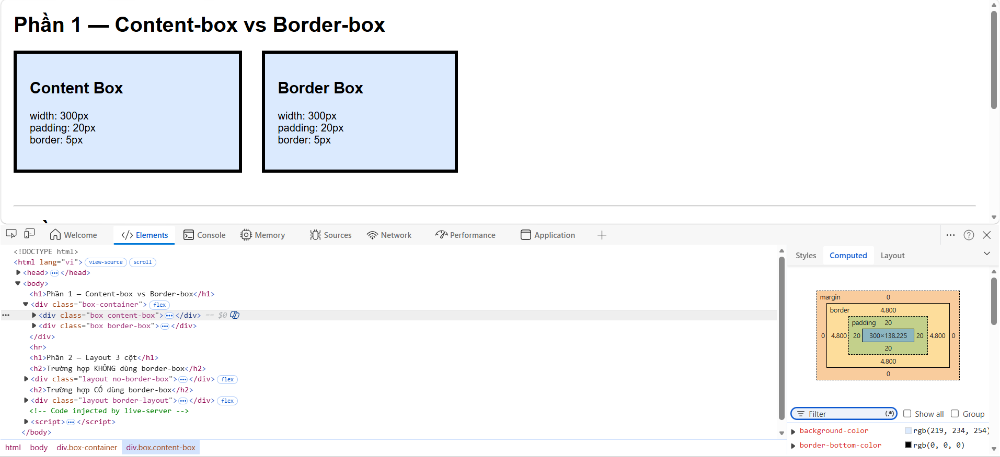
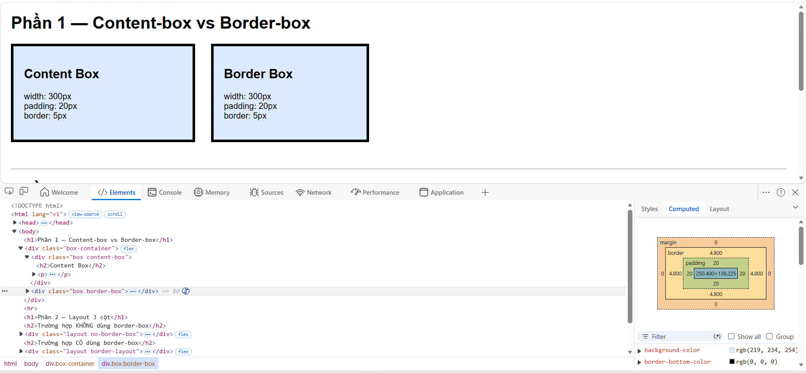
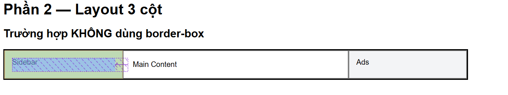
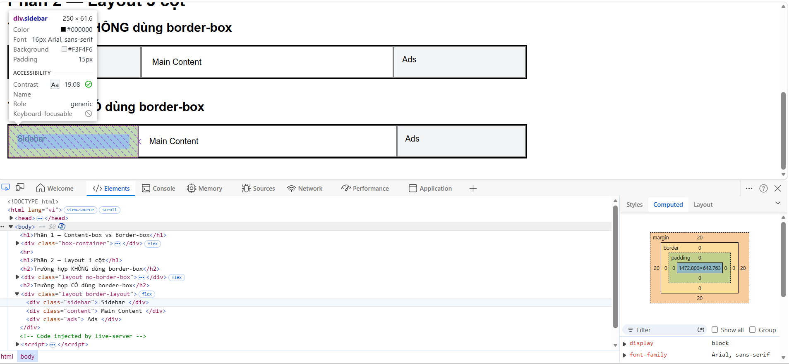
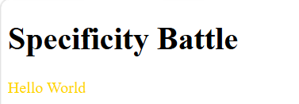
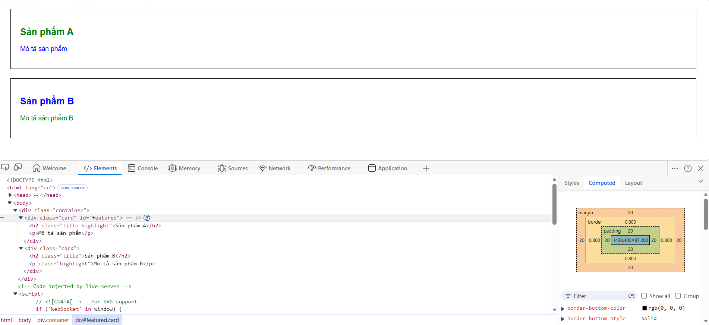

# PHẦN A — KIỂM TRA ĐỌC HIỂU (25 điểm)

## Câu A1: 3 Cách nhúng CSS vào HTML

### 1. Inline CSS (CSS trực tiếp trong thẻ)
Phương pháp này sử dụng thuộc tính `style` ngay bên trong thẻ HTML.

* **Ví dụ:**
    ```html
    <h2 style="color: red; font-size: 24px;">Đây là tiêu đề màu đỏ</h2>
    ```
* **Ưu điểm:** * Có độ ưu tiên cao nhất.
    * Tiện lợi khi muốn thay đổi nhanh một phần tử duy nhất.
* **Nhược điểm:** * Làm code HTML trở nên cồng kềnh, khó đọc.
    * Khó bảo trì vì phải tìm từng thẻ để sửa.
    * Không thể tái sử dụng định dạng cho các phần tử khác.
* **Khi nào nên dùng:** Khi cần áp dụng style riêng biệt cho một phần tử duy nhất hoặc test nhanh giao diện.

### 2. Internal CSS (CSS nội bộ)
Sử dụng thẻ `<style>` đặt bên trong thẻ `<head>` của trang HTML.

* **Ví dụ:**
    ```html
    <head>
        <style>
            body { background-color: #f4f4f4; }
            p { color: blue; line-height: 1.6; }
        </style>
    </head>
    ```
* **Ưu điểm:** * Quản lý tập trung toàn bộ style của một trang web trong một file duy nhất.
    * Có thể sử dụng các bộ chọn (class, id) để định dạng nhiều phần tử cùng lúc.
* **Nhược điểm:** * Chỉ có tác dụng trên một file HTML duy nhất. 
    * Nếu website có nhiều trang, việc lặp lại code sẽ gây lãng phí và khó cập nhật.
* **Khi nào nên dùng:** Khi làm một trang web đơn lẻ (Landing Page) hoặc khi trang đó có những định dạng hoàn toàn khác biệt với phần còn lại của website.

### 3. External CSS (CSS bên ngoài)
Viết CSS trong một file riêng biệt (đuôi `.css`) và liên kết vào HTML bằng thẻ `<link>`.

* **Ví dụ:**
    * *File `style.css`:*
        ```css
        h1 { color: darkgreen; text-align: center; }
        ```
    * *File `index.html`:*
        ```html
        <head>
            <link rel="stylesheet" type="text/css" href="style.css">
        </head>
        ```
* **Ưu điểm:** * Tách biệt hoàn toàn nội dung (HTML) và định dạng (CSS).
    * Một file CSS có thể dùng cho nhiều trang khác nhau, dễ bảo trì và nâng cấp.
    * Giúp trang web load nhanh hơn nhờ cơ chế bộ nhớ đệm (cache) của trình duyệt.
* **Nhược điểm:** Phải thực hiện thêm một yêu cầu gửi đến server để tải file CSS.
* **Khi nào nên dùng:** Đây là cách **phổ biến và tối ưu nhất** cho mọi dự án thực tế.

---

## Độ ưu tiên trong CSS

**Câu hỏi:** Nếu cùng 1 element có cả 3 cách CSS đồng thời áp dụng, cách nào "thắng"?

**Trả lời:** Cách **Inline CSS** sẽ "thắng" (có độ ưu tiên cao nhất).

**Giải thích:**
Trình duyệt quy định độ ưu tiên (Specificity) theo thứ tự giảm dần như sau:
1.  **Inline CSS** (Style trực tiếp trên thẻ) - Điểm ưu tiên cao nhất.
2.  **Internal CSS** và **External CSS** (Độ ưu tiên ngang nhau).
3.  **Mặc định của trình duyệt.**

*Lưu ý:* Nếu giữa **Internal** và **External** có xung đột, quy tắc nào được trình duyệt đọc **sau cùng** (nằm thấp hơn trong code HTML) sẽ được áp dụng. Tuy nhiên, cả hai đều sẽ bị **Inline CSS** ghi đè lên. Nếu muốn phá vỡ quy tắc này,  dùng từ khóa `!important`.  

## Câu A2: 
h1 → Chọn: Thẻ ```<h1>``` có nội dung "ShopTLU"  

.price → Chọn: 2 thẻ ```<p>``` có nội dung "25.990.000đ" và "45.990.000đ"  

#app header → Chọn: Toàn bộ khối thẻ``` <header>``` (bao gồm cả ```<h1>``` "ShopTLU" và thẻ ```<nav>``` chứa các menu Home, Products, About).  

nav a:first-child → Chọn: Thẻ ```<a>``` đầu tiên nằm trong ```<nav>```, có nội dung "Home"  

.product.featured h2 → Chọn: Thẻ ```<h2>``` nằm trong phần tử có đồng thời class product và featured, có nội dung "MacBook Pro"  

article > p → Chọn: Cả 4 thẻ ```<p>``` là con trực tiếp của thẻ ```<article>```, bao gồm: "25.990.000đ", "Mô tả sản phẩm..." (của iPhone) và "45.990.000đ", "Mô tả sản phẩm..." (của MacBook).  

a[href="/"] → Chọn: Thẻ ```<a>``` có chính xác thuộc tính href="/", nội dung "Home"  

.top-bar.dark h1 → Chọn: Thẻ ```<h1>``` nằm trong phần tử có đồng thời class top-bar và dark, có nội dung "ShopTLU"  

## Câu A3  
**Trường hợp 1: content-box (mặc định)**  
.box-1 {  
    width: 400px;  
    padding: 20px;  
    border: 5px solid black;  
    margin: 10px;  
}
1. Chiều rộng hiển thị = content + padding trái/phải + border trái/phải = 400 + 20*2 + 5*2
= 400 + 40 + 10
= 450px
2. Không gian chiếm trang = chiều rộng hiển thị + margin trái/phải = 450+10*2 = 470px

**Trường hợp 2: border-box**  
.box-2 {  
    box-sizing: border-box;  
    width: 400px;  
    padding: 20px;  
    border: 5px solid black;  
    margin: 10px;  
}
1. Chiều rộng hiển thị = 400px
2. Kích thước content = 400 - padding trái/phải - border trái/phải = 400 - 20*2 - 10*2 =  350px
3. Không gian chiếm trang = width + margin trái/phải = 400 + 10*2 = 420px

**Trường hợp 3: Margin collapse**
.box-a { margin-bottom: 25px; }  
.box-b { margin-top: 40px; }  
Khoảng cách box-a - box-b = 40px
Không phải 65px (25+40) bởi vì Browser sẽ lấy margin lớn hơn (Chúng collapse) thành một margin duy nhất  
Nhưng khi  
.box-a { margin-bottom: -10px; }  
.box-b { margin-top: 40px; }  
Khoảng cách giữa box-a với box-b là 30px bởi vì có margin âm  
## Câu 4:  
1. **Tính specificity score**
Specificity thường viết dạng: (a, b, c)  
Trong đó:  
a = số lượng ID  
b = số lượng class / pseudo-class / attribute  
c = số lượng tag  


Rule A  
p { color: black; }  
ID: 0  
class: 0  
tag p: 1  
Specificity:  
(0, 0, 1)  


Rule B  
.price { color: blue; }  
ID: 0  
class .price: 1  
tag: 0  
Specificity:  
(0, 1, 0)


Rule C  
#main-price { color: red; }  
ID: 1  
class: 0  
tag: 0  
Specificity:  
(1, 0, 0)


Rule D  
p.price { color: green; }  
ID: 0  
class .price: 1  
tag p: 1  
Specificity:  
(0, 1, 1)  

2. **Element sẽ có màu gì?**

| Rule | Score   |
| ---- | ------- |
| A    | (0,0,1) |
| B    | (0,1,0) |
| C    | (1,0,0) |
| D    | (0,1,1) |

CSS ưu  tiên: ID > class > tag  
Rule mạnh nhất là: #main-price { color: red; } vì (1,0,0)  
=> element có màu: **red**  

3. Nếu thêm ```<p class="price" id="main-price" style="color: orange;">```   
element sẽ có màu: **orange** vì inline style > ID selector

4. Nếu rule A thêm important    
element sẽ có màu: **black** vì !important > inline style thường > ID > class > tag  

# Phần B:  
## Bài B1: Liệt kê selector đã dùng trong file profile.html
**Các loại selector đã sử dụng**

1. Element selector
- body
- table
- footer

2. ID selector
- #main-header

3. Class selector
- .profile-section
- .active

4. Descendant selector
- nav a

5. Pseudo-class selector
- a:hover
- tr:nth-child(even)
- tr:hover

## Bài B2:  
### Phần 1 — Content-box vs Border-box

#### Hộp 1 (content-box)

- width khai báo: 300px
- padding: 20px x 2 = 40px
- border: 5px x 2 = 10px

Chiều rộng thực tế:

300 + 40 + 10 = 350px


#### Hộp 2 (border-box)

Chiều rộng thực tế:

300px

Vì padding và border đã được tính bên trong width.


#### Giải thích sự khác biệt

- content-box:
width chỉ tính phần content.
Padding và border sẽ cộng thêm vào kích thước thật.

- border-box:
width bao gồm luôn content + padding + border.
Kích thước thật giữ nguyên đúng bằng width khai báo.

---

### Phần 2 — Layout 3 cột

#### Không dùng border-box

Tổng thực tế:

- Sidebar:
250 + 30 + 4 = 284px

- Content:
500 + 40 + 4 = 544px

- Ads:
250 + 30 + 4 = 284px

Tổng:

284 + 544 + 284 = 1112px

=> Bị vượt quá container 1000px.


### Có dùng border-box

Tổng:

250 + 500 + 250 = 1000px

=> Vừa đúng container.



## bài B3: 10 Rules + Specificity Score

1. p  
Specificity: 0,0,1

2. .text  
Specificity: 0,1,0

3. .highlight  
Specificity: 0,1,0

4. p.text  
Specificity: 0,1,1

5. p.highlight  
Specificity: 0,1,1

6. .text.highlight  
Specificity: 0,2,0

7. #demo  
Specificity: 1,0,0

8. p#demo  
Specificity: 1,0,1

9. #demo.text  
Specificity: 1,1,0

10. p#demo.text.highlight  
Specificity: 1,2,1

---

**Element cuối cùng hiển thị màu gì?**

Màu cuối cùng là: gold

Vì selector:

p#demo.text.highlight

có specificity cao nhất:

1,2,1

nên nó ghi đè tất cả các rules khác.  


---

**Nếu thay đổi thứ tự CSS rules thì sao?**

- Nếu specificity khác nhau:
Kết quả KHÔNG đổi.

Ví dụ:
#demo vẫn thắng .text
dù viết trước hay sau.

- Nếu specificity bằng nhau:
Rule viết SAU sẽ thắng.

Ví dụ:
.text và .highlight
đều có specificity:
0,1,0

nên selector viết cuối cùng sẽ được áp dụng.


# PHẦN C — DEBUG & SUY LUẬN


## Câu C1 — Debug CSS Layout

## 1. Tính chiều rộng thực tế của sidebar và content (content-box)  


.container {  
    width: 960px;  
    margin: 0 auto;  
}  
.sidebar {  
    width: 300px;  
    padding: 20px;  
    border: 1px solid #ccc;  
    float: left;  
}  
.content {  
    width: 660px;  
    padding: 30px;  
    border: 1px solid #ccc;  
    float: left;  
}  


Chiều rộng của sidebar =  width + padding trái + padding phải + border trái + border phải = 342  
chiều rộng của content  = 60 + 30 + 30 + 1 + 1 = 722  
## 2. Giải thích tại sao layout bị vỡ   
Layout bị vỡ bởi vì tổng chiều rộng là 342 + 722 = 1064px trong khi container chỉ rộng 1064px

# Câu C2 — Cascade Puzzle

---

## 1. "Sản phẩm A" (`h2.title.highlight`)

HTML:

```html
<h2 class="title highlight">Sản phẩm A</h2>
```

---

## Font-size = ?

### CSS liên quan

```css
body { font-size: 16px; }

.container { font-size: 14px; }

.card .title { font-size: 20px; }
```

---

## Quá trình cascade + inheritance

### Bước 1

`body`

```css
font-size: 16px;
```

→ tất cả phần tử con có thể kế thừa `16px`

---

### Bước 2

`.container`

```css
font-size: 14px;
```

→ phần tử bên trong `.container` kế thừa `14px`

---

### Bước 3

`.card .title`

```css
font-size: 20px;
```

Selector này target trực tiếp `h2`.

Specificity:

```text
.card .title
= (0,2,0)
```

cao hơn inheritance.

---

## Kết quả

```text
font-size = 20px
```

---

# Color = ?

## CSS liên quan

```css
body { color: #333; }

#featured .title { color: red; }

.highlight { color: green !important; }
```

---

## Quá trình cascade

### Rule 1

```css
body { color: #333; }
```

→ inheritance màu xám.

---

### Rule 2

```css
#featured .title { color: red; }
```

Specificity:

```text
(1,1,0)
```

→ mạnh hơn body.

---

### Rule 3

```css
.highlight { color: green !important; }
```

Specificity:

```text
(0,1,0)
```

nhưng có:

```text
!important
```

`!important` thắng tất cả rule thường.

---

## Kết quả

```text
color = green
```

---

# Kết luận câu 1

```text
"Sản phẩm A"

font-size = 20px
color = green
```

---

## 2. "Mô tả sản phẩm" (`p` trong featured card)

HTML:

```html
<p>Mô tả sản phẩm</p>
```

---

## CSS liên quan

```css
body { color: #333; }

.card { color: blue; }

.card p { color: inherit; }
```

---

## Quá trình cascade + inheritance

### Bước 1

`body`

```css
color: #333;
```

---

### Bước 2

`.card`

```css
color: blue;
```

→ div.card có màu xanh.

---

### Bước 3

```css
.card p { color: inherit; }
```

`inherit` nghĩa là:

```text
lấy màu của phần tử cha
```

Cha của `p` là:

```html
<div class="card" id="featured">
```

`.card` có:

```css
color: blue;
```

---

## Kết quả

```text
color = blue
```

---

# 3. "Sản phẩm B" (`h2.title`)

HTML:

```html
<h2 class="title">Sản phẩm B</h2>
```

---

# Font-size = ?

Rule áp dụng:

```css
.card .title { font-size: 20px; }
```

---

## Kết quả

```text
font-size = 20px
```

---

# Color = ?

Không có:

- `.highlight`
- `#featured`

nên không có rule đặc biệt.

---

## CSS liên quan

```css
body { color: #333; }

.card { color: blue; }
```

`color` là thuộc tính kế thừa.

`h2` nằm trong `.card`

→ kế thừa:

```css
color: blue;
```

---

## Kết quả

```text
color = blue
```

---

# Kết luận câu 3

```text
"Sản phẩm B"

font-size = 20px
color = blue
```

---

# 4. "Mô tả sản phẩm B" (`p.highlight`)

HTML:

```html
<p class="highlight">Mô tả sản phẩm B</p>
```

---

## CSS liên quan

```css
.card p { color: inherit; }

.highlight { color: green !important; }
```

---

## Cascade

### Rule 1

```css
.card p { color: inherit; }
```

→ lấy màu từ `.card`

```text
blue
```

---

### Rule 2

```css
.highlight { color: green !important; }
```

có:

```text
!important
```

→ thắng hoàn toàn.

---

## Kết quả

```text
color = green
```

---

# Kết luận cuối cùng

| Element | Font-size | Color |
|---|---|---|
| Sản phẩm A | 20px | green |
| Mô tả sản phẩm | — | blue |
| Sản phẩm B | 20px | blue |
| Mô tả sản phẩm B | — | green |





**Link Video Thuyết trình:** https://drive.google.com/file/d/1YxJ4clCigAogAPFW93ik1Ai_Qi3rFX__/view?usp=sharing


