# PHẦN A — KIỂM TRA ĐỌC HIỂU (20 điểm)

## Câu A1 (10đ) — 5 Loại Positioning

| Position | Vẫn chiếm chỗ trong flow? | Tham chiếu vị trí | Cuộn theo trang? | Use case |
|---|---|---|---|---|
| static | Có | Theo flow mặc định của trang | Có | Layout thông thường |
| relative | Có | So với vị trí ban đầu của chính nó | Có | Dịch chuyển nhẹ phần tử mà vẫn giữ chỗ cũ |
| absolute | Không | So với nearest positioned ancestor | Có | Overlay, icon, badge, popup nhỏ |
| fixed | Không | So với viewport (màn hình trình duyệt) | Không | Menu cố định, nút back-to-top |
| sticky | Có | Theo container cha và viewport | Ban đầu có, tới ngưỡng thì dính lại | Thanh menu dính khi cuộn |

---


`absolute` sẽ tham chiếu `body` (hoặc viewport) khi KHÔNG có ancestor nào có:

nearest positioned ancestor = phần tử tổ tiên gần nhất có position khác static.

nearest positioned ancestor = phần tử tổ tiên gần nhất có `position` khác `static`.


## Câu A2  
# Câu A2 — Flexbox vs Grid

## Trường hợp 1

```css
.container { display: flex; }
.item { flex: 1; }
```

- Có 4 item.
- `flex: 1` → các item chia đều chiều ngang container.

### Bố cục:

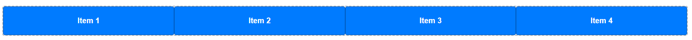

→ 1 hàng, 4 cột bằng nhau.

---

## Trường hợp 2

```css
.container {
    display: flex;
    flex-wrap: wrap;
}

.item {
    width: 45%;
    margin: 2.5%;
}
```

- Mỗi item chiếm:
  - width = 45%
  - margin trái + phải = 5%
- Tổng = 50%

→ Mỗi hàng chứa được 2 item.

Có 6 item nên:

- 3 hàng
- 2 cột

### Bố cục:

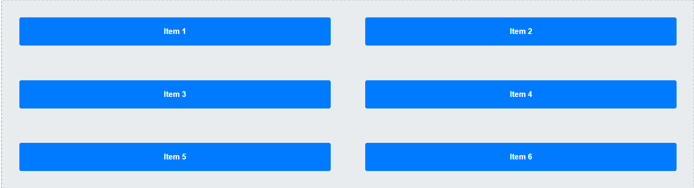

---

## Trường hợp 3

```css
.container {
    display: flex;
    justify-content: space-between;
    align-items: center;
}
```

- `justify-content: space-between`
  → item đầu sát trái, item cuối sát phải, item giữa nằm giữa.
- `align-items: center`
  → các item căn giữa theo chiều dọc.

Có 3 item:

### Bố cục:

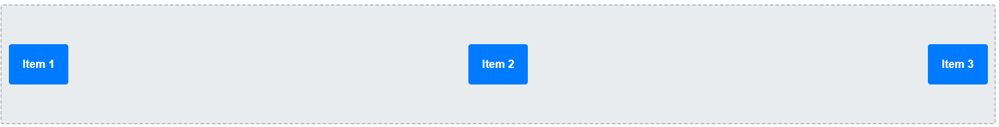

→ 1 hàng ngang, khoảng cách đều nhau.

---

## Trường hợp 4

```css
.container {
    display: grid;
    grid-template-columns: 200px 1fr 200px;
    gap: 20px;
}
```

- Grid có 3 cột:
  - Cột 1 = 200px
  - Cột 2 = chiếm phần còn lại (`1fr`)
  - Cột 3 = 200px
- `gap: 20px` → khoảng cách giữa các cột.

Có 3 item nên mỗi item nằm trên 1 cột.

### Bố cục:

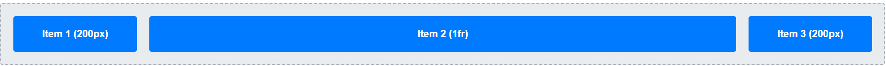

→ 1 hàng, 3 cột.

---

## Trường hợp 5

```css
.container {
    display: grid;
    grid-template-columns: repeat(3, 1fr);
    gap: 10px;
}
```

- `repeat(3, 1fr)` → tạo 3 cột bằng nhau.
- Có 7 item.

Cách sắp xếp:

- Hàng 1: item 1 2 3
- Hàng 2: item 4 5 6
- Hàng 3: item 7

### Bố cục:

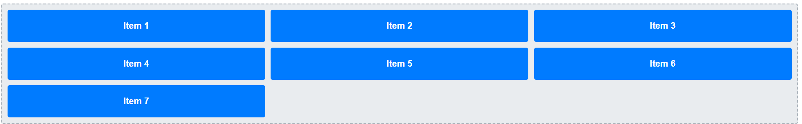

→ Tổng cộng:
- 3 hàng
- 3 cột
- Item 7 nằm ở hàng cuối, cột đầu tiên.  


# PHẦN C — SUY LUẬN (20 điểm)

## Câu C1 (10đ) — Flexbox vs Grid

### 1. Navigation bar ngang (logo + menu + buttons)

**Dùng:** `Flexbox`

**Giải thích:**  
Navbar là layout 1 chiều theo hàng ngang.

```css
.navbar{
    display: flex;
    justify-content: space-between;
    align-items: center;
}
```

---

### 2. Lưới ảnh Instagram (3 cột đều nhau, số ảnh không biết trước)

**Dùng:** `Grid`

**Giải thích:**  
Đây là layout dạng lưới 2 chiều.

```css
.gallery{
    display: grid;
    grid-template-columns: repeat(3, 1fr);
    gap: 10px;
}
```

---

### 3. Layout blog: main content + sidebar

**Dùng:** `Flexbox`

**Giải thích:**  
Chỉ cần chia 2 cột ngang.

```css
.layout{
    display: flex;
}

.content{
    flex: 1;
}

.sidebar{
    width: 300px;
}
```

---

### 4. Footer với 4 cột thông tin

**Dùng:** `Grid`

**Giải thích:**  
Grid giúp chia cột đều và responsive tốt.

```css
.footer{
    display: grid;
    grid-template-columns: repeat(4, 1fr);
    gap: 20px;
}
```

---

### 5. Card sản phẩm

**Dùng:** `Flexbox`

**Giải thích:**  
Sắp xếp nội dung theo chiều dọc và đẩy nút xuống đáy.

```css
.card{
    display: flex;
    flex-direction: column;
}

.btn{
    margin-top: auto;
}
```

---

# Câu C2 (10đ) — Debug Flexbox

# Lỗi 1 — Cards không đều chiều cao

## Nguyên nhân

Text trong mỗi card dài ngắn khác nhau nên chiều cao card khác nhau.

## Code sửa

```css
.card-container{
    display: flex;
    flex-wrap: wrap;
}

.card{
    width: 30%;
    margin: 1.5%;

    display: flex;
    flex-direction: column;
}

.card img{
    width: 100%;
}

.card h3{
    font-size: 18px;
}

.card .btn{
    padding: 10px;
    margin-top: auto;
}
```

## Trước khi sửa

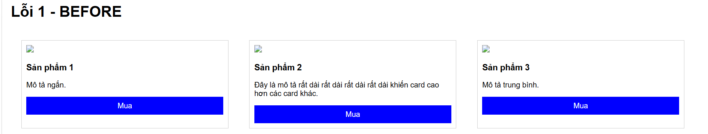

## Sau khi sửa
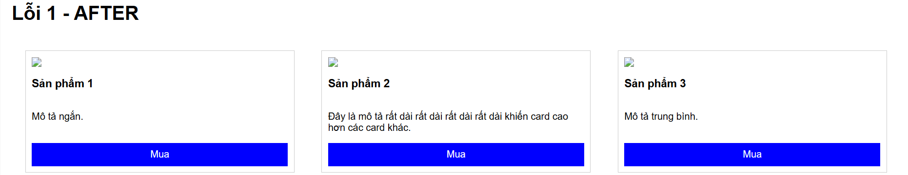

---

# Lỗi 2 — Item không nằm giữa màn hình

## Nguyên nhân

Container có display:flex nhưng chưa căn giữa ngang và dọc.

## Code sửa

```css
.hero{
    height: 100vh;
    display: flex;

    justify-content: center;
    align-items: center;
}

.hero-content{
    text-align: center;
}
```

## Trước khi sửa

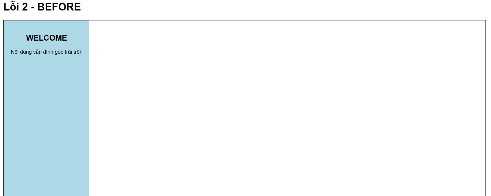

## Sau khi sửa
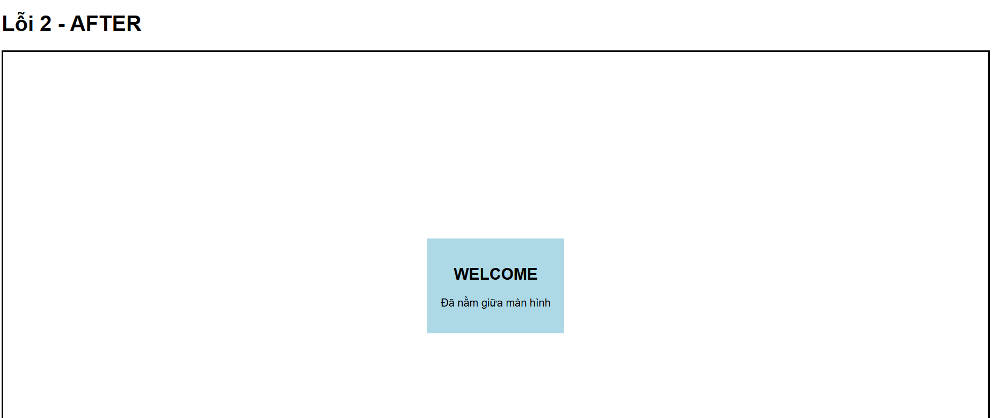

---

# Lỗi 3 — Sidebar bị co lại

## Nguyên nhân

Flexbox mặc định cho phép item bị co lại.

## Code sửa

```css
.layout{
    display: flex;
}

.sidebar{
    width: 250px;
    flex-shrink: 0;
}

.content{
    flex: 1;
}
```
## Trước khi sửa

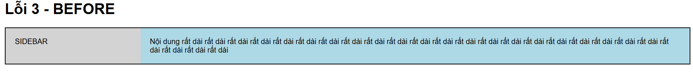

## Sau khi sửa
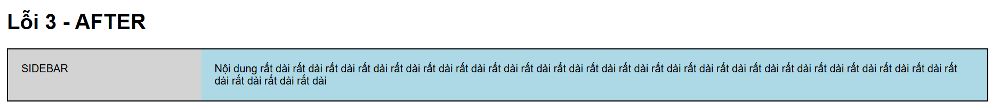


 